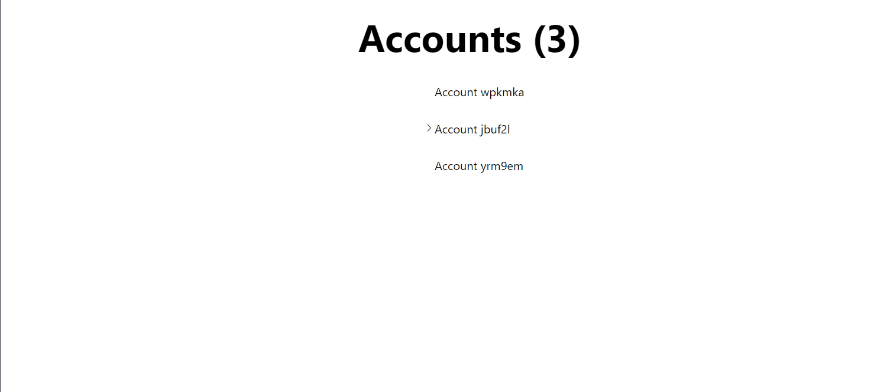

Hi

this project was built with the following configuration


to run the project clone it

and then run

npm install

and then npm run dev

1) so the databse will be no-sql in order to simplify things

   example document

```
   {
   _id: ObjectId,     
   name: String,      
   has_children: Boolean, 
   subaccounts: [     
       {
       _id: ObjectId, 
       name: String,   
       has_children: Boolean, 

       
       
       },
   
   ]
   }
```

the API will return
Get all accounts:

Method: GET
Endpoint: /accounts
Description: Retrieves all the accounts stored in the database.

Get a specific account by ID:

Method: GET
Endpoint: /accounts/{id}
Description: Retrieves a specific account by its ID.

Get subaccounts for a specific account:

Method: GET
Endpoint: /accounts/{id}/subaccounts
Description: Retrieves the subaccounts belonging to a specific account.

Create subaccounts for a specific account:
Method: POST
Endpoint: /accounts/createAccount/

body:
parentId // if the parentId is null then the account will be created as parent
account: {name,...etc}

